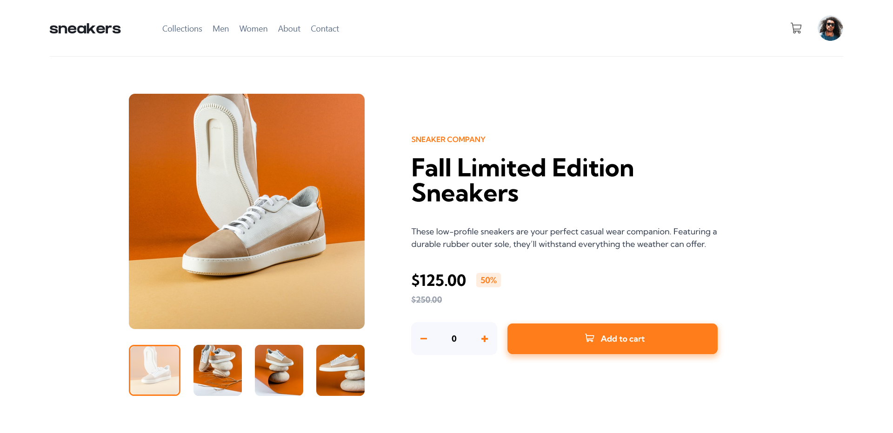
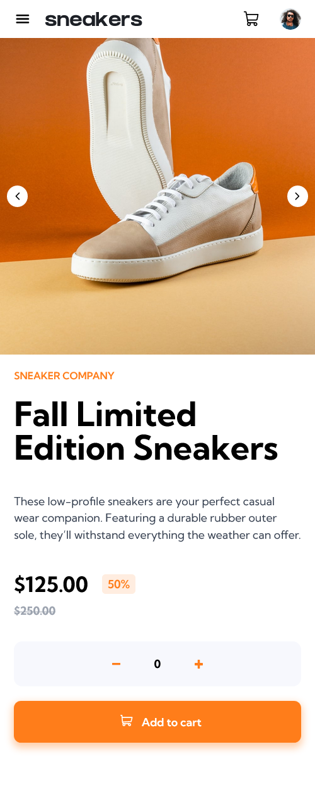

# Frontend Mentor - Solução para a seção interativa de comentários

Esta é uma solução para o [E-commerce product page challenge on Frontend Mentor](https://www.frontendmentor.io/challenges/ecommerce-product-page-UPsZ9MJp6)

## Visão Geral

### O Desafio

Os usuários devem ser capazes de:

- Visualizar o layout otimizado para o site, dependendo do tamanho da tela do dispositivo.
- Ver estados de hover para todos os elementos interativos na página
- Abrir uma galeria de lightbox ao clicar na grande imagem do produto.
- Alternar a grande imagem do produto ao clicar nas miniaturas pequenas.
- Adicionar itens ao carrinho.
- Visualizar o carrinho e remover itens dele.

### Imagens

### Links

- URL da Solução: [Front-end Mentor](https://www.frontendmentor.io/solutions/responsive-landing-page-using-tailwind-css-a6ET6WK3Br)
- URL do Site Ao Vivo: [Vercel](https://ecommerce-challenge-nogq.vercel.app/)

## Meu processo

### Desenvolvido com

- Marcação HTML5 Semântica
- Propriedades personalizadas CSS
- Flexbox
- Tailwind css
- [React](https://reactjs.org/) - React com Typescript

### O que aprendi

#### Tailwind CSS

Foi o meu primeiro contato com uma biblioteca CSS, e achei extremamente útil as funcionalidades da tecnologia. As classes utilitárias torna o processo de desenvolvimento muito mais rápido, além de tornar o arquivo 
de estilos menos sobrecarregado. O processo de tornar o design responsivo também ficou muito mais simples e ágil.

### Recursos úteis

- [Curso de Tailwind CSS: estilizando a sua página com classes utilitárias ](https://cursos.alura.com.br/course/tailwind-css-estilizando-pagina-classes-utilitarias)

## Autor

- Linkedin - [@juan-gabriel-sa](https://www.linkedin.com/in/juan-gabriel-sa/)
